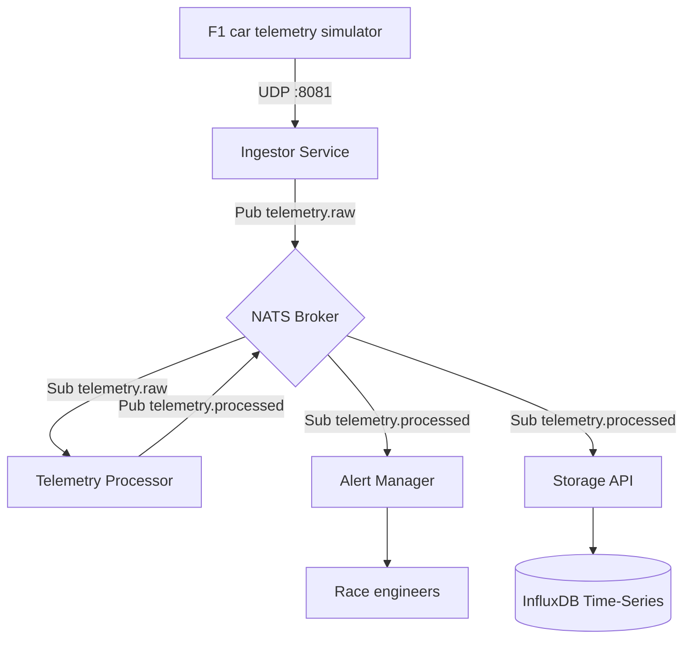

# ApexStream 🏎️💨

[](https://github.com/raphaelrreis/apexstream/actions/workflows/ci.yml)

ApexStream is a high-performance distributed system for real-time Formula 1 telemetry processing, built with Go.

## 🎯 Project Goal (Portfolio Showcase)
This project is designed to demonstrate modern and idiomatic Go architectural patterns, focusing on:
- **Safe Concurrency:** Extensive use of *Worker Pools*, `context.Context`, and *Channels*.
- **Low Latency & Edge Processing:** Binary stream decoding and on-the-fly mathematical calculations.
- **Distributed Systems:** Microservices architecture communicating via **NATS** (High-performance Pub/Sub).
- **gRPC & Protobuf:** Contract-first development for low-latency internal communication.
- **Observability:** *Structured Logging* (`slog`) and Time-Series data storage.

## 🧭 Architecture
The system follows a distributed, event-driven architecture. UDP ingestion keeps the edge path lightweight, NATS decouples services, workers enrich telemetry concurrently, and InfluxDB stores processed data for post-session analysis.



### Engineering Decisions
- **UDP for ingestion:** prioritizes fresh telemetry over retransmitting stale packets.
- **NATS pub/sub:** keeps services independently deployable and horizontally scalable.
- **Worker pool processing:** bounds concurrency while handling telemetry bursts.
- **Async InfluxDB writes:** batches persistence work outside the critical processing path.

## 🏗️ Microservices Architecture (Monorepo)
The project is divided into four main modules located in the `cmd/` directory:

| Module | Responsibility | Local README |
| :--- | :--- | :--- |
| `ingestor` | Receives UDP telemetry and publishes validated raw packets to NATS. | [`cmd/ingestor`](cmd/ingestor/README.md) |
| `processor` | Enriches telemetry through concurrent worker-pool processing. | [`cmd/processor`](cmd/processor/README.md) |
| `alert-manager` | Evaluates processed telemetry and emits safety/performance alerts. | [`cmd/alert-manager`](cmd/alert-manager/README.md) |
| `storage-api` | Persists processed telemetry into InfluxDB for analysis. | [`cmd/storage-api`](cmd/storage-api/README.md) |
| `simulator` | Generates local F1 telemetry over UDP for demos and smoke tests. | [`cmd/simulator`](cmd/simulator/README.md) |

## 🛠️ Tech Stack
- **Language:** Go (1.22+)
- **Messaging:** NATS.io
- **Database:** InfluxDB 2.x
- **Communication:** gRPC + Protobuf / UDP
- **Infrastructure:** Docker & Docker Compose

## 🚀 Getting Started

### Prerequisites
- Docker & Docker Compose
- Go 1.22+

### Spin up Infrastructure
```bash
make infra-up
```

### Run Services
Open separate terminals for each service:

```bash
go run cmd/ingestor/main.go
go run cmd/processor/main.go
go run cmd/alert-manager/main.go
go run cmd/storage-api/main.go
```

Then start the simulator:

```bash
go run cmd/simulator/main.go -mode overheat -freq 8
```

## 📜 API Contracts
Contracts are defined using Protocol Buffers in the `api/` directory.
- `api/telemetry.proto`: Defines the telemetry message structure and gRPC streaming services.

## ✅ Quality Gates
The CI workflow runs on every push and pull request:

```bash
go test ./... -v
go vet ./...
make build
```
