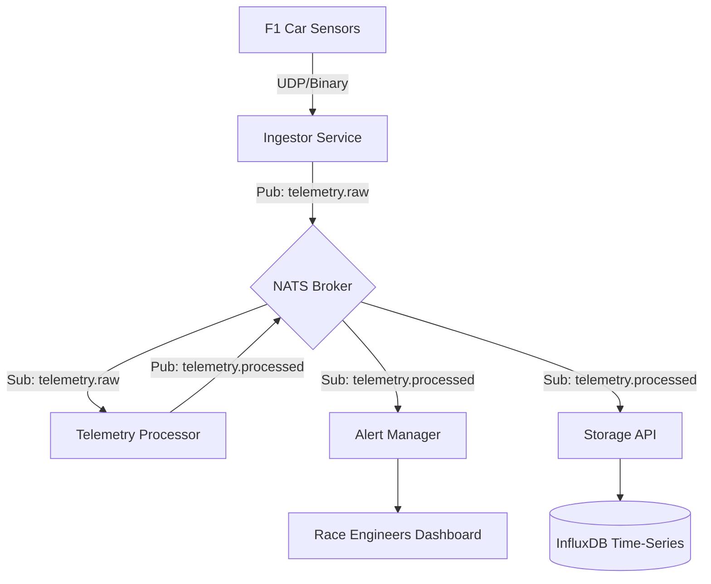

# ApexStream: System Architecture & Design Decisions

This document outlines the architectural blueprint, technological choices, and engineering motivations behind the **ApexStream** F1 Telemetry platform.

## 1. Motivation
Formula 1 is the pinnacle of motorsport and engineering. A modern F1 car generates over **1.1 million data points per second** through 300+ sensors. The challenge is not just collecting this data, but processing, analyzing, and acting upon it in milliseconds to make split-second strategic decisions.

**ApexStream** was built to showcase how modern Go microservices can handle high-throughput, low-latency data streams using a decoupled, event-driven architecture.

## 2. System Architecture
The system follows a **Distributed Microservices Architecture** connected via a high-performance message broker.

## 3. Technology Stack & Rationales

### 3.1. Programming Language: Go (Golang)
- **Why:** Go offers a perfect balance between high performance (compiled language) and developer productivity.
- **Concurrency:** Its native support for Goroutines and Channels allows us to process thousands of sensor updates in parallel without the overhead of traditional threading models.
- **Binary Size:** Compiles into small, static binaries, ideal for containerization (Docker/Kubernetes).

### 3.2. Messaging: NATS.io
- **Why:** NATS is a cloud-native messaging system written in Go. It is significantly faster and lighter than Kafka for real-time telemetry use cases.
- **Pattern:** We use **Subject-based Messaging** (Pub/Sub) and **Queue Groups** to ensure load balancing and high availability.

### 3.3. Database: InfluxDB (Time-Series)
- **Why:** Traditional SQL databases struggle with the ingestion rate of high-frequency telemetry. InfluxDB is optimized for time-stamped data, providing efficient compression and high-speed queries for lap-by-lap analysis.

### 3.4. Communication: gRPC & Protocol Buffers
- **Why:** JSON is human-readable but slow and bulky. F1 telemetry requires a compact binary format. Protobuf reduces payload size by up to 80% compared to JSON, and gRPC provides typed contracts and streaming capabilities.

## 4. Key Engineering Decisions (ADRs)

### ADR 001: UDP for Ingestion
We chose UDP for the initial car-to-pit-wall transmission. In racing environments, network stability varies. UDP is "fire and forget," avoiding the overhead of TCP handshakes and ensuring that the most recent data point is always prioritized over re-transmitting old, lost packets.

### ADR 002: Worker Pool Pattern in Processor
To prevent CPU bottlenecks, the `processor` module implements a Worker Pool. This limits the number of concurrent Goroutines to a controlled amount, preventing the service from being overwhelmed during peak data bursts (e.g., during the start of a race).

### ADR 003: Asynchronous Buffered Writes (Storage)
Writing to a database is an I/O bound operation. The `storage-api` uses an asynchronous buffer to batch multiple telemetry points before sending them to InfluxDB, drastically reducing the number of HTTP calls and improving overall system throughput.

### ADR 004: Kubernetes Orchestration
By using Kubernetes, we can scale the `processor` horizontally. If we need to monitor 20 cars instead of 1, we simply increase the replica count in our `services.yaml` manifest.

## 5. Module Breakdown
- **Ingestor**: Decouples the car's radio frequency from the internal network.
- **Processor**: The computational engine for tire wear, fuel, and thermal models.
- **Alert Manager**: Real-time anomaly detection and safety watchdog.
- **Storage API**: Long-term archival and debriefing data provider.
